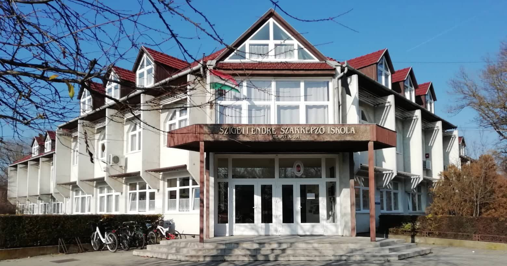
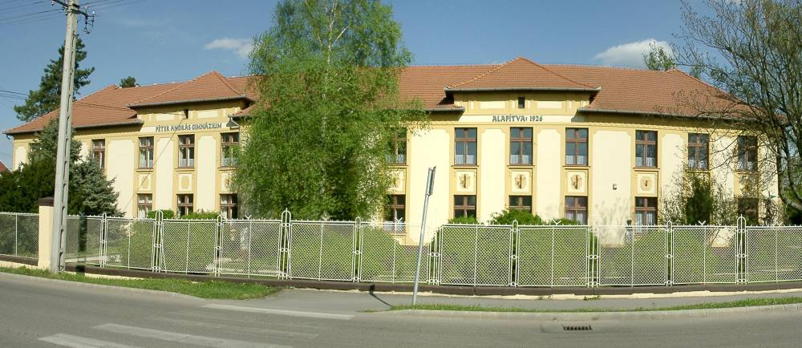
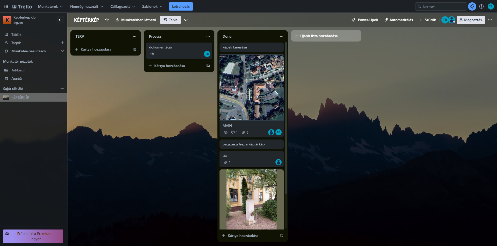

# Szeghalom egyetemei
## Készítette:
- Tóth Bence
- Éri Tibor Dániel
 ---
 
 ---
### Péter András Gimnázium és a Szigeti Endre Szakképző Iskola
### A Térképet és CSS-t közös munkával oldottuk meg.
 ---
#### Mivel Daninak a Pag-os, Bencének pedig Szeszis múltja van, ezért megegyeztünk hogy a saját volt iskolánk oldalát csinálja meg.
 ---
##### A munkánkat Trello segítségével követtük és vezettük végig.

 ---
##### A munkamenet:
- Téma megbeszélése
- Képek keresése
- Iskolák elosztása
- Munka ellenőrzése és feltöltése Githubra
- Dokumentáció elkészítése
  
  ---
### [Szigeti Endre Suli](https://szeszi.hu/)
### [Péter András Suli](https://pag.edu.hu/)
